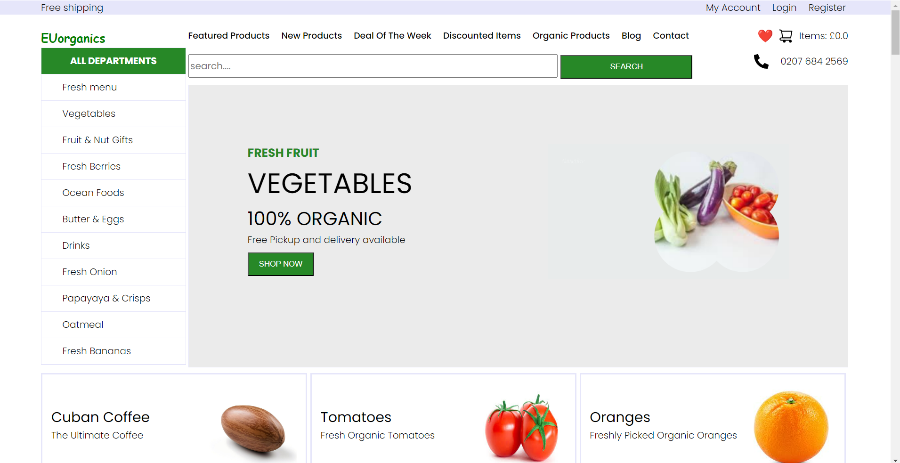

# Fruit Store Website - Backend

## _The Server-Side Solution for Fresh Produce_



The backend for the Fruit Store website is designed to manage server-side operations for a seamless online shopping experience for fresh fruits and vegetables. Built with Django, it handles user authentication, product management, and more, making the application a fullstack solution.

- **Develop the backend to manage product listings**
- **Secure user authentication and registration**
- **API endpoints for frontend integration**
- ✨ **Robust & Scalable** ✨


## Table of Contents
- [Features](#features)
- [Tech](#tech)
- [Current Status](#current-status)
- [Secret Key Setup](#secret-key-setup)
- [Email setup](#email-setup)
- [GEO location API setup](#geo-location-api-setup)
- [Django Application Setup with PostgreSQL](#django-application-setup-with-postgresql)
- [Django Q setup](#django-q-setup)
- [Django-HTML Syntax Highlighting in VS Code](#Django-HTML-Syntax-Highlighting-in-VS-Code)
- [Create a superuser](#creating-a-superuser)
- [Overview](#overview)
- [Setting up the API Keys for Your FAQ Bot](#setting-up-the-api-keys-for-your-faq-bot)


## Features

- **User Registration and Login:** Secure user registration, login, and account management.
- **Product Management:** CRUD (Create, Read, Update, Delete) operations for managing fruit and vegetable listings.
- **Shopping Cart:** Comprehensive shopping cart management for adding, updating, and removing items.
- **Order Processing:** Functionality to handle order creation, processing, and tracking.
- **API Endpoints:** RESTful API endpoints for frontend integration and external communication.
- **Product Search and Filters:** Search functionality and filters for users to find products easily.
- **Wishlist:** Option for users to save and manage their favorite products.
- **Review and Ratings:** Feature to allow users to leave reviews and ratings for products.
- **Checkout System:** Secure checkout process including payment integration.

## Tech

The backend uses several technologies and libraries:

- [Django](https://www.djangoproject.com/) - High-level Python Web framework
- [Python](https://www.python.org/) - Programming language for backend development
- [HTML](https://developer.mozilla.org/en-US/docs/Web/HTML) - The skeleton of the website
- [CSS](https://developer.mozilla.org/en-US/docs/Web/CSS) - Styles for the site
- [JavaScript](https://developer.mozilla.org/en-US/docs/Web/JavaScript) - Client-side functionality
- [PostgreSQL/MySQL](https://www.postgresql.org/) - Database for data storage (configure in `settings.py`)

## Current Status (In progress)

**Features Implemented:**

- **Index Page:** Basic routing and homepage setup.
- **Accounts Page:** User registration and login functionality.
- **Product Management Page:** Initial wiring completed; some product cards still in progress.

**Future Work:**

- **Product Management Integration:** Finalize integration of product management features.
- **Rewiring and Integration:** Complete the rewiring of HTML pages, navigation to use Django templates, and ensure JavaScript functions properly with Django.
- **Shopping Cart Functionality:** Develop and integrate comprehensive shopping cart management.
- **Additional API Endpoints:** Create and implement additional API endpoints as needed.
- **Frontend Integration:** Ensure seamless integration with the frontend.
- **Extensive Development:** Address a range of significant tasks across various components to ensure full functionality and integration, covering all remaining aspects of backend development.
- Add responsiveness to the site so that it can handle all screen sizes as not all elements respond to different windows sizes e.g small, etc

## Email setup 

To send emails using Django, you'll need to configure its email backend. There are various email service providers, such as Mailgun and SendGrid which offer solutions for sending emails. However, on free plans, these services often place you in a sandbox environment with restrictions, such as limited sending capabilities or the need to verify recipient addresses.

A popular alternative is to use Gmail, which is free and allows you to send emails without these sandbox limitations. However, Gmail does have sending limits—typically 500 emails per day for regular accounts and 2,000 emails per day for Google Workspace accounts. To use Gmail with Django we first need to adjust our Gmail account settings to allow Django to send emails on its behalf. This includes enabling access for an `App Password` if you have two-factor authentication enabled.

### How to Generate an App Password in Gmail

To begin you need to generate an app password for Gmail, this is necessary when setting up your Google account on a device or in an application that doesn't support two-step verification. Without enabling 2-factor authentication `App passwords` will not be available.

### Step 1: Enable Two-Step Verification

1. Go to your [Google Account](https://myaccount.google.com/).
2. Navigate to the **Security** tab.
3. Under **Signing in to Google**, click on **2-Step Verification**.
4. Follow the instructions to enable Two-Step Verification.

### Step 2: Generate an App Password

1. After enabling Two-Step Verification, return to the **Security** tab in your Google Account.
2. In the search bar type in **App passwords** option and click on it when you see. If prompted, sign in again.
3. Now type in the name of the app you want to create the `authentication code` for and hit `create`
4. A popup will appear with a generate code e.g `yele liof uwkg qdvc`
5. A 16-character password will be generated. Copy this password.

### Important Notes

- **One-time Use:** The app password is a one-time code, and so you don't need to remember it, and if you ever lose it, you can generate a new one.
- **Security:** If you suspect that your account has been compromised, you can revoke the `app password` and any apps using it will have its access revoked. You can do this at any time in your Google Account under **App passwords**.

## How to use the App password to send emails

Open up the `.env.example` and copy the following block into the `.env` file

```
EMAIL_BACKEND = 'django.core.mail.backends.smtp.EmailBackend'
EMAIL_HOST = 'smtp.gmail.com'
EMAIL_PORT = 587
EMAIL_USE_TLS = True
EMAIL_HOST_USER = 'your-email@gmail.com'   # your gmail account
EMAIL_HOST_PASSWORD = 'your-app-password'  # Use the generated App Password here
```
Replace the `EMAIL_HOST_USER` and `EMAIL_HOST_PASSWORD` with your email and 16 digit app. Note, you only need to change
the last two if you are using gmail, however if you are using a different email provider you need to the entire block with their email services providers


## Secret Key Setup

To ensure the security of your Django project, you must set a `SECRET_KEY` in your environment variables. This key is critical for various cryptographic operations in Django, including session management, password hashing, and more.

### Creating the `.env` File

1. **Create a `.env` File:**
   - Create a `.env` file in the root of your project directory. The `.env` file should reside outside the 'src' directory where `requirements.txt` and `.env.example` are located.
   - Use the `.env.example` file as a guide. Copy its contents into your new `.env` file and replace any placeholder values as needed.

2. **How to Set the Secret Key:**
   - **Option 1: Generate a Secret Key Online:**
     - Use an online generator like [Django Secret Key Generator](https://djecrety.ir/) to generate a secure key.
   - **Option 2: Generate a Secret Key Using the Project's Utility Function:**
     - Use the `generateSessionKey()` function found in the `utils` module of this project to generate a secure key.

### Setting the Secret Key in `.env`

Once you have your secret key, add it to the `.env` file as follows:


SECRET_KEY='your_generated_secret_key_here'


## Django Application Setup with PostgreSQL

### Database Setup with PostgreSQL

1. **Download and Install PostgreSQL:**
   - Visit the [PostgreSQL download page](https://www.postgresql.org/download/) and install PostgreSQL for your operating system.

2. **Create a Database:**
   - After installing PostgreSQL, use a tool like pgAdmin (often included with PostgreSQL) or the `psql` command-line tool to create a new database for your application.

3. **Configure Your Application:**
   - Copy the following `.env.example` file to the `.env` and replace it with your postgresl setup:
    
   - Update the `.env` file with your database configuration:
     ```plaintext
     DB_NAME=your_database_name
     DB_USER=your_database_user
     DB_PASSWORD=your_database_password
     DB_HOST=localhost
     DB_PORT=5432
     ```
4. **Run python manage.py migrate:**
   - Run the migrate command above to migrate the changes

Your application should now be set up with PostgreSQL.

### 5. Configure `USE_LOCAL_DB` in `settings.py`

- In the `settings.py` file, locate the `USE_LOCAL_DB` variable and manually set its value to `True`. 
  This will configure the application to use the local database instead of the external one.
- This step is required because, for some reason, the `.env` file is not processing the value of the `USE_LOCAL_DB` variable correctly. 
  It appears as though the variable doesn't exist, causing issues when trying to load the setting from the environment, so to rectify
  this manually set it to `True` for local and `False` for external.


## Geo location API setup

I```markdown
## Geo-Location API Setup  

To detect suspicious login activity, such as logging in from two geographically impossible locations within a short period (e.g., logging in from London and 30 minutes later from New York), this application uses the `ipinfo` API. The API converts an IP address into its geo-location, enabling the application to identify unusual activity.  

By signing up for the API, you are granted **50,000 free requests per month**.  

---

### Setting up the API  

To begin using this API you first need to sign up for the API, you are granted 50,000 free requests per month.

1. **Sign Up**  
   - Visit [ipinfo.io](https://ipinfo.io/).  
   - Sign up using your Gmail, Github or another email address.  
   - After signing up, you will be automatically redirected to the dashboard.  

2. **Retrieve Your API Token and Global IP Address**  
   - On the dashboard, you will see an overview that includes your global IP address in step 1 and an API token in step 3.  
   - Make a note of the global IP address and token for later use.  

3. **Test the API**  
   You can test the API using the `curl` command or using python function `requests` module :  
   ```bash  
   # Replace <GLOBAL_IP_ADDRESS> and <API_TOKEN> with your values  
   curl ipinfo.io/<GLOBAL_IP_ADDRESS>?token=<API_TOKEN>  
   ```  
   Sample response:  
   ```json  
   {  
     "ip": "<GLOBAL_IP_ADDRESS>",  
     "hostname": "example-hostname",  
     "city": "Example City",  
     "region": "England",  
     "country": "GB",  
     "loc": "51.5098,-0.1180",  
     "org": "Example Organisation",  
     "postal": "EC1A 1BB",  
     "timezone": "Europe/London"  
   }  

   with request:

   import requests

   ip     = "<GLOBAL_IP_ADDRESS>"  # Replace this with the IP you're testing
   token  = "<API_TOKEN>"

   # API URL and key
   api_url = f"ipinfo.io/{ip}?token={token}"

   # Make the request
   response = requests.get(api_url)

   # Check the response
   if response.status_code == 200:
      print("API Response:", response.json())
   else:
      print("Error:", response.status_code, response.text)
   ```

4. **Configure Your Environment Variables**  
   - Open the `.env.example` file and copy its contents into your `.env` file.  
   - Add your global IP address and API token as follows:  

   ```env  
   CLIENT_IP_ADDRESS=<Your_Global_IP_Address>  
   IPINFO_API_KEY=<Your_API_Token>  
   MODE=development  

   Double check that MODE=development
   ```  

   ```
   - **`CLIENT_IP_ADDRESS`**: The global IP address assigned to you by your ISP.  
   - **`IPINFO_API_KEY`**: The API token used to retrieve geo-location data.  
   - **`MODE`**: Defines the application's mode (`development` or `production`).  

   ```

### Why the `MODE` Variable is Necessary  

When running the application in **development mode**, the IP address returned by Django requests is a `localhost` address (e.g., `127.0.0.1`) or a subnet address (e.g., `192.168.x.x`), which is meaningless outside your local network.  

To ensure the application functions correctly during development, the `MODE` variable tells the application to use the global IP address provided in the `.env` file instead of the local IP address. Without this configuration, the application cannot retrieve valid geo-location data, as `localhost` and subnet addresses are not suitable for external lookups.  


### Django Q setup

This application uses Django-Q, a lightweight alternative to Celery, for handling background tasks efficiently. One key use case for this application is sending emails in the background.

By offloading email sending to Django-Q, the application avoids blocking the main thread which ensures that users experiences a responsive interface while emails are processed asynchronously/in the background.


### Email Processing with Django-Q

This application uses **Django-Q** to handle email sending asynchronously. Here is a brief outline:

1. **Asynchronous Processing**:
   - Email tasks are queued and processed in the background.
   - The task result will determine whether the email was successfully sent.

2. **Result Handling**:
   - Successful email sending will log a success message and return `True`.
   - Failures or errors during email processing will log the issue and provide detailed information about the cause.

3. **How to Monitor Task Results**:
   - Results are logged to the configured logger (`app.log` by default which is in the same level as the `src` directory).
   - Results can also be viewed in Django Admin section
   - You can also check Django-Q's task queue use custom hooks for result processing.

4. **Expected Wait Times**:
   - Email tasks are usually processed within a few seconds, depending on server load and network conditions.
   - If an email isn't sent immediately, it could be due to:
     - Network issues.
     - Problems with the email provider.
     - No more storage or close to full storage in your email account

5. **Debugging**:
   - If an email task fails, review the logs or task queue for error details.
   - Check your admin with Django-Q section
   - Common issues include invalid email addresses, network timeouts, or misconfigured email settings.


### Additonal information about Django-Q

```
Django-Q is a popular task queue and scheduling library for Django. This application enables you to offload time-consuming or asynchronous tasks by
allowing them to be manage/run in the background without blocking the main application. Tasks can also be scheduled to perform recurring tasks. 

The key features and capabilities:

### **Key Features:**
1. **Asynchronous Task Processing:**
   - Execute tasks in the background without blocking the main application.
   - Supports concurrent task execution using multiprocessing.

2. **Task Scheduling:**
   - Built-in scheduler for running recurring tasks (e.g., periodic or cron-like jobs).

3. **Cluster Support:**
   - Run task workers on multiple servers, enabling horizontal scaling.
   - Distribute workload across the cluster.

4. **Database-backed Broker:**
   - Tasks are stored in the database, which simplifies the setup.
   - No need for external brokers like Redis or RabbitMQ, although support for Redis is also available.

5. **Result Persistence:**
   - Store task results in the database for easy retrieval.
   - Query task statuses and results directly from the database.

6. **Integration with Django:**
   - Works seamlessly with Django's ORM and settings.
   - Customizable to fit Django applications.

7. **Flexible Configuration:**
   - Control worker concurrency, timeout, retries, and other settings.

8. **Hook Functions:**
   - Define custom hooks to execute additional logic after task completion (e.g., success or failure).

9. **Secure Pickling:**
   - Safely serialize tasks using Django's pickling mechanism, ensuring compatibility and security.

---

### **When to Use Django-Q:**
- When your application needs to handle long-running or time-consuming tasks.
- When you require periodic or scheduled tasks.
- When you prefer a simpler setup without external dependencies like Celery.


### Why Django-Q?

Lightweight: Ideal for projects that don't require the full complexity of Celery.
Efficiency: Handles tasks like email sending seamlessly in the background.
User Experience: Prevents the application from freezing while waiting for tasks to complete.


### **Example Use Cases:**
1. Sending emails or notifications.
2. Processing large datasets.
3. Generating reports asynchronously.
4. Running scheduled tasks, such as daily backups or clean-ups.
5. Offloading intensive computations to background workers.


```

For more information, visit the official Django-Q documentation: [Django-Q Official Documentation](https://django-q.readthedocs.io/en/latest/)


### **How to use Django-Q with this application - run the Worker:**

Open a separate terminal and enter the following command. This will tell the application to use Django-Q

```bash
   python manage.py qcluster
```

Once that is done open another terminal and then enter the following

```bash
   python manage.py runserver
```


### Django-HTML Syntax Highlighting in VS Code


Enhance your Django development experience by enabling **Django-HTML** syntax highlighting in Visual Studio Code (VS Code). This guide will walk you through the installation process to get the best out of your Django templates with proper syntax highlighting, auto-completion, and error checking.

## 🎯 Why Use Django-HTML Syntax Highlighting?

When working on Django projects, your HTML templates often contain Django-specific syntax, such as `` for template tags and `{{ }}` for expressions. By enabling Django-HTML syntax highlighting in VS Code, you get:

- **Improved Readability**: Clearly distinguish between HTML and Django template syntax.
- **Enhanced Development Experience**: Enjoy features like auto-completion, code snippets, and error checking tailored for Django.
- **Increased Productivity**: Quickly identify syntax errors and improve coding efficiency.

## 🚀 Getting Started

Follow these steps to set up Django-HTML syntax highlighting in VS Code:

### Step 1: Install Visual Studio Code

If you haven't already installed VS Code, download it from the [official website](https://code.visualstudio.com/) and follow the installation instructions for your operating system.

### Step 2: Install the Django Template Extension

To enable Django-HTML syntax highlighting, you'll need to install a VS Code extension. Here's how:

1. Open **Visual Studio Code**.
2. Go to the **Extensions** view by clicking on the **Extensions icon** in the sidebar or pressing `Ctrl+Shift+X` (Windows/Linux) or `Cmd+Shift+X` (Mac).
3. In the **Search bar**, type **Django**.
4. Find the extension named **"Django"** by **Baptiste Darthenay** and click **Install**.


### Step 3: Configure Syntax Highlighting

1. After installing the extension, open any `.html` file in your Django project.
2. VS Code should automatically detect the Django template syntax and apply the Django-HTML highlighting.
3. If not, manually change the language mode:
   - Click on the language mode indicator in the bottom right corner of the status bar (usually says `HTML`).
   - Select **"Django HTML"** from the dropdown list.

### Step 4: Optional - Install Additional Extensions

To further enhance your Django development experience, consider installing these additional extensions:

- **Django** by **Baptiste Darthenay** - Provides Django snippets and additional functionalities.
- **Python** by **Microsoft** - Essential for Python development, with features like IntelliSense, linting, and debugging.

## ⚙️ Troubleshooting

If you face any issues with syntax highlighting:

- Ensure that the **Django** extension is installed and enabled.
- Restart VS Code after installation.
- Verify that your template files have the correct `.html` extension.
- In VS code you can switch between templates using the bottom right corner. If you are using html VScode should
automatically detect that the templates is HTML and vice-versa with with Django-html. However, if that is not the case click on `HTML` a dropdown will now appear with `auto-detect` on top, now in the search bar enter `Django-HTML` and hit
`Enter` now any Django snippets will be highlighted with the proper colour and syntax


## 📚 Additional Resources

- [Django Documentation](https://docs.djangoproject.com/en/stable/): Official Django documentation for templates and more.
- [VS Code Django Extension Guide](https://marketplace.visualstudio.com/items?itemName=batisteo.vscode-django): Detailed guide and documentation for the Django extension.

## 🎉 Congratulations!

You now have Django-HTML syntax highlighting enabled in VS Code! 
---


## Setting up the API Keys for Your FAQ Bot

The website uses a FAQ bot for customer support. The bot has been trained to answer questions related to the site (e.g., orders, account details, etc.) and will not answer any questions unrelated to the site.

To set up the API key for the FAQ bot, follow these steps:

1. Visit the website: [https://aistudio.google.com/apikey](https://aistudio.google.com/apikey)
2. Click on **"Create an API Key"**.
3. If you're not signed in, the website will prompt you to sign in with your Google account. Once signed in:
    - Click on **"Create an API Key"** again.
    - From the dropdown menu, select **"Gemini API"** and copy the key.
4. Open your `.env` file (if you don't have one, create it in the root of your project).
5. Paste the API key inside the `.env` file under the variable `API_KEY`. For example:

    ```bash
    API_KEY=your_api_key_here
    ```

6. Ensure your `.env` file is not tracked in version control (add it to `.gitignore` if necessary).

That's it! You're ready to use the FAQ bot with the API key configured.


## Creating a Superuser

To manage your Django application through the admin interface, you need to create a superuser. Follow these steps:

### Step 1: Create a Superuser

1. **Activate your virtual environment** (if not already activated):
   - For Unix or macOS:
     ```bash
     source venv/bin/activate
     ```
   - For Windows:
     ```bash
     venv\Scripts\activate
     ```

2. **Navigate to your project directory** (where `manage.py` is located):
   ```bash
   cd src
   ```

3. **Run the `createsuperuser` command**:
   ```bash
   python manage.py createsuperuser
   ```

4. **Enter the required details**:
   - **Username**: Choose a username for your superuser.
   - **Email address**: Provide an email address.
   - **Password**: Set a strong password and confirm it.

   After completing these prompts, Django will create your superuser account.

### Step 2: Access the Django Admin Interface

1. **Run the development server** (if it's not already running):
   ```bash
   python manage.py runserver
   ```

2. **Open the Django admin interface** in your web browser:
   ```plaintext
   http://127.0.0.1:8000/admin/
   ```

3. **Log in** with the superuser credentials you created.

Once logged in, you'll have full access to manage your Django project's data and settings through the admin interface.


## Quick Overview

```

## Overview

To set up the backend environment, follow these instructions:

```bash
# Clone the repository
git clone https://github.com/EgbieAndersonUku1/Fullstack-fruit-and-veg.git .
# The period at the end specifies that the repository should be cloned into the current directory.

# Set up a virtual environment
python3 -m venv venv

# Activate the virtual environment you should see (venv) in front of the path 
# For Unix or MacOS
source venv/bin/activate
# For Windows
venv\Scripts\activate

# Navigate to the src folder (make sure you are in the same directory as requirements.txt)
cd src

# Install dependencies
pip install -r requirements.txt

# Run migrations
python manage.py migrate

# open a separate terminal and enter the following command
python manage.py qcluster

# Run the development server
python manage.py runserver

# Navigate to the application
http://127.0.0.1:8000/
```


